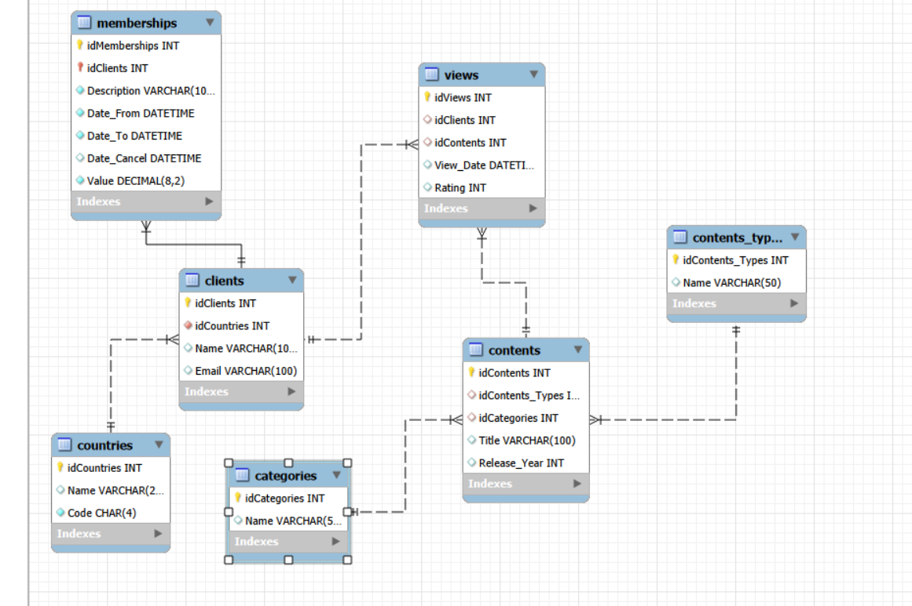
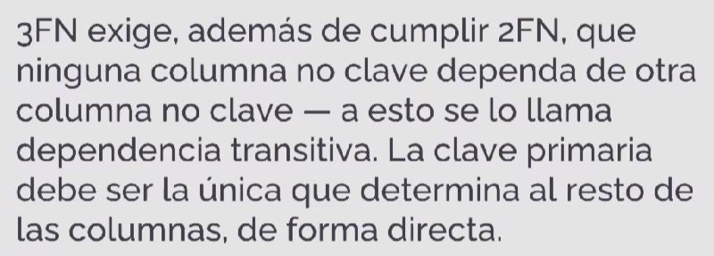
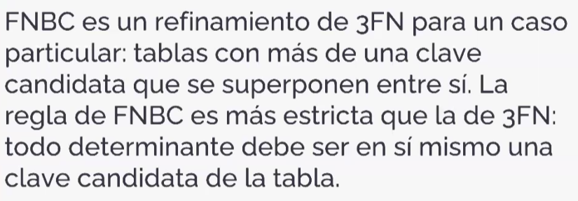
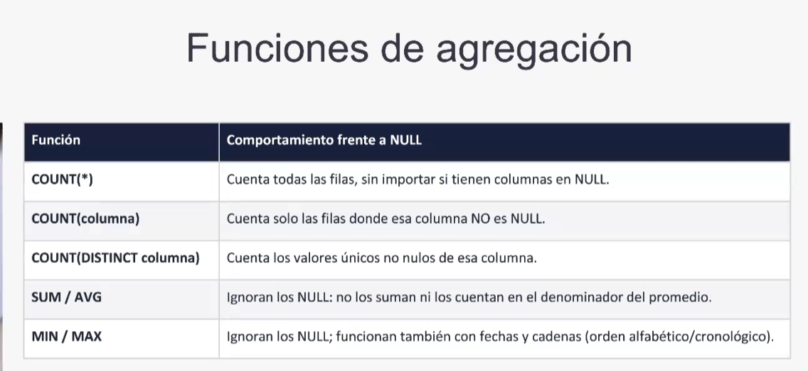
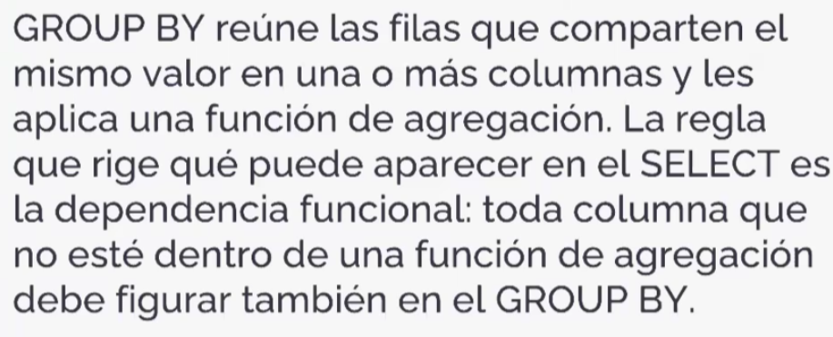
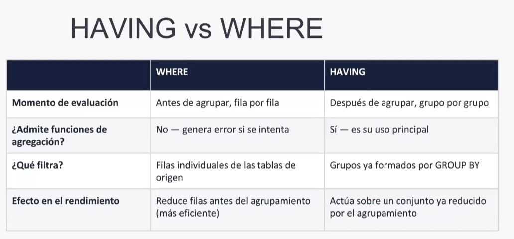
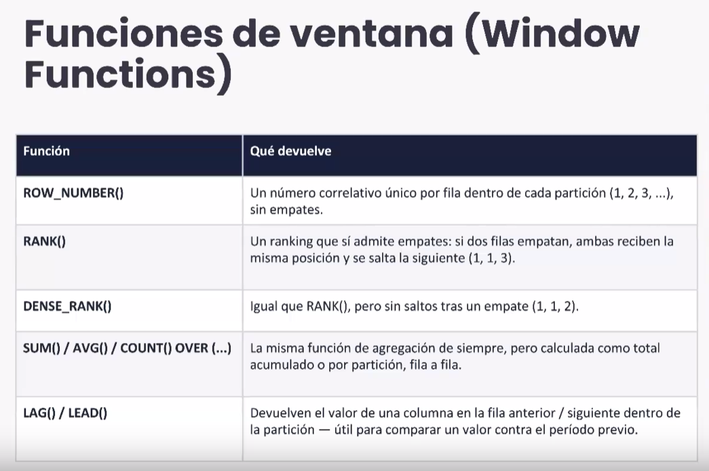
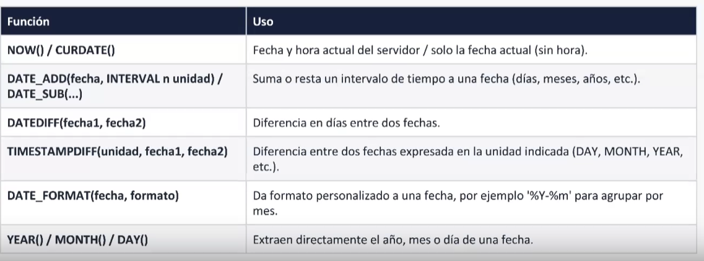
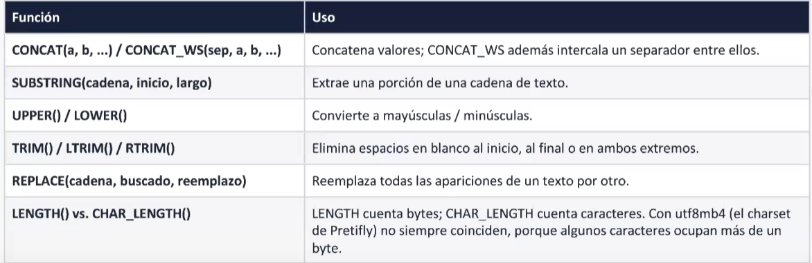

# UTN - Base de Datos II - MySQL

Repositorio correspondiente a la materia **Base de Datos II** de la **Tecnicatura Universitaria en Programación (UTN)**.

## Objetivo

Este repositorio contiene prácticas, ejercicios y apuntes relacionados con el diseño, creación y manipulación de bases de datos utilizando **MySQL**.

Durante la cursada se trabajan conceptos fundamentales para el desarrollo de software orientado a datos, desde la creación de estructuras hasta la realización de consultas y gestión de información.

## Contenidos trabajados

- Creación y modificación de tablas.
- Claves primarias y claves foráneas.
- Claves primarias compuestas.
- Relaciones entre tablas.
- Restricciones (`CONSTRAINT`).
- `INSERT`, `UPDATE` y `DELETE`.
- Consultas con `SELECT`.

## Diagrama Entidad-Relación

DER correspondiente a las tablas trabajadas durante la cursada.

### SQL

- **DDL (Data Definition Language)**
  - Creación y modificación de bases de datos.
  - Creación y definición de tablas.
  - Claves primarias y claves foráneas.
  - Relaciones entre entidades.

- **DML (Data Manipulation Language)**
  - Inserción de datos (`INSERT`).
  - Actualización de registros (`UPDATE`).
  - Eliminación de registros (`DELETE`).
  - Consultas de información (`SELECT`).

- **DCL (Data Control Language)**
  - Gestión de permisos y usuarios.

- **TCL (Transaction Control Language)**
  - Manejo de transacciones.
  - Confirmación y rollback de operaciones.

## Herramientas utilizadas

- MySQL
- DBeaver
- Git / GitHub

### Normalizacion 

### Funciones de agregación

### GROUP BY

### HAVING

### HAVING vs WHERE

### Funciones de ventana

### Funciones de Fecha
- MySQL ofrece un conjunto amplio de funciones para trabajar con
- DATE, DATETIME y TIMESTAMP

### Funciones de Cadena
- Las funciones de cadena permiten combinar, recortar
- transformar y medir textos directamente en la consulta:

**Carrera:** Tecnicatura Universitaria en Programación  
**Institución:** Universidad Tecnológica Nacional (UTN)